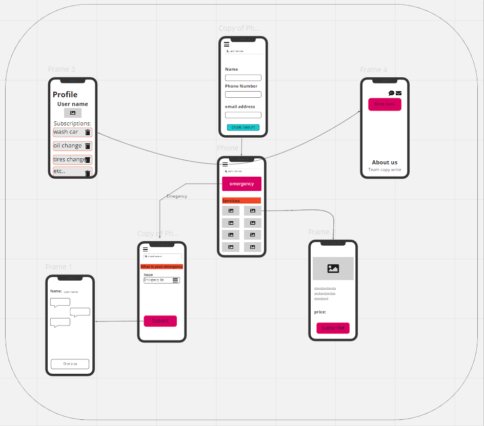
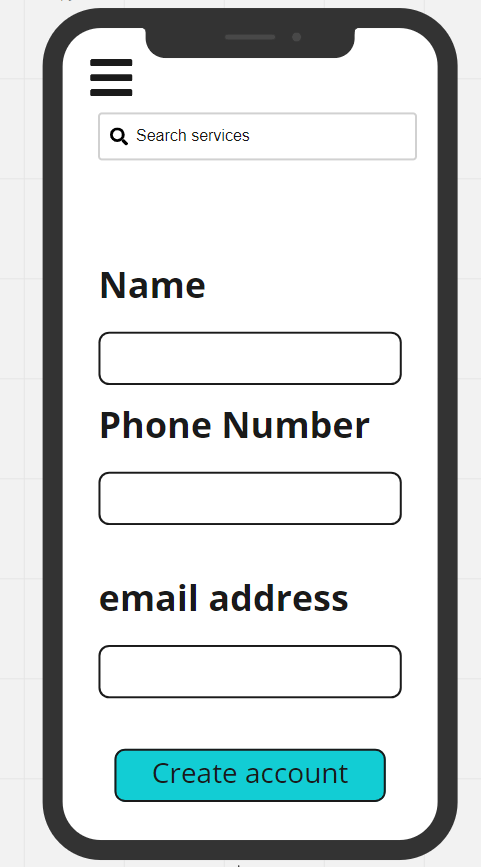
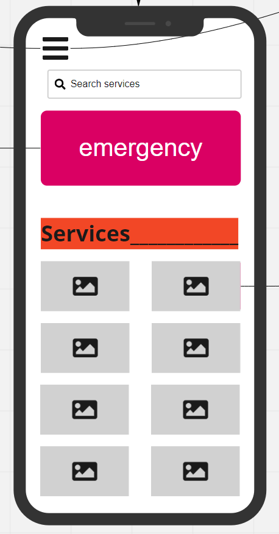
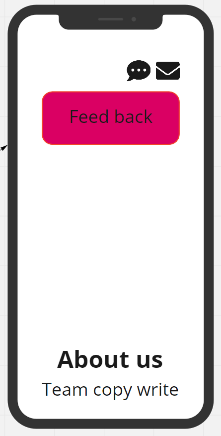
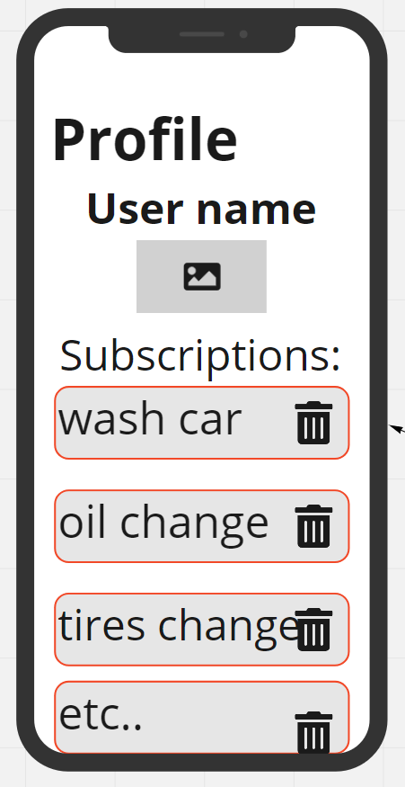
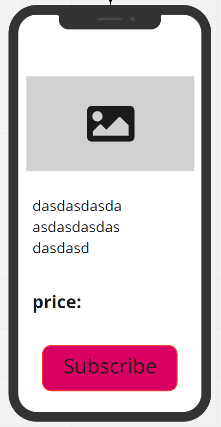
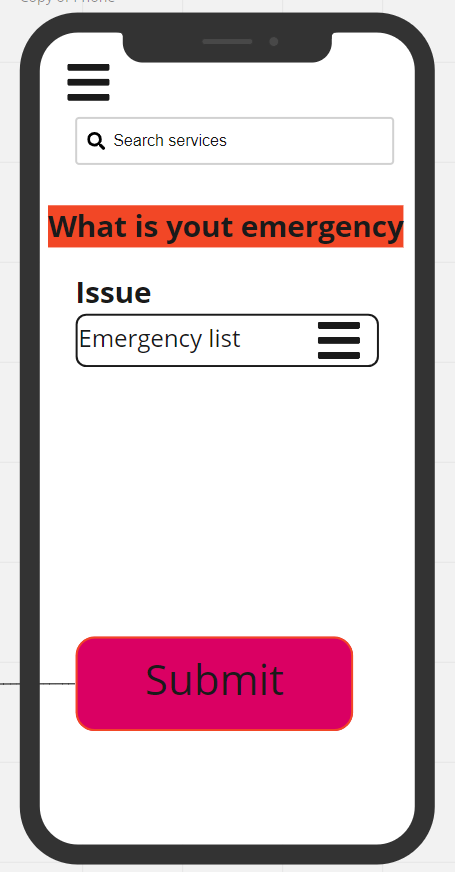
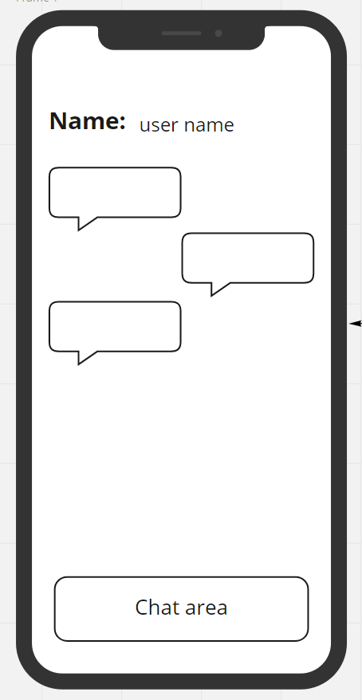

# Garage-Mobile-frontend

# Authors:
- Essam Omar

- Omar Humamah

- Dima Al-Absi

- Aseel Al-Asaad

- Rami Zregat

---

# Project Description:
- It is an application that supports the user to easily access services related to his car in case of emergency and others.

- This app using real-time events for executing, and presenting an application that showcases an event driven architecture. programming concepts:
 A “hub” server that moderates all events.
 Multiple “clients” that connect to the hub which can .both publish and subscribe to events
 Must operate over a network.

---
# User Stories: 
- As a user when an accident happen with me at a road, I want an app that help me to fix my issue in an easy & fast way.
- As a user I want an app that includes many services for my car at one application, so that it saves my time.
- As a user I want an app indicates Chatting feature, so I can describe my issue & communicate to know the latest services related to my car.

---

# Wireframe:

---

## Login

---

## Home Page

---
## About Us

---
## Profile

---
## Service

---
## Emergency

---
## Chat

---
# How to start the application:

- `npm start` then press "w" in the terminal

